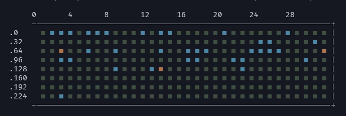
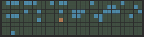
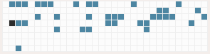
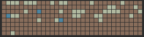
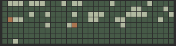
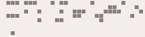
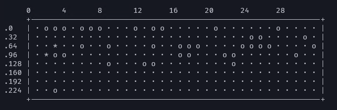
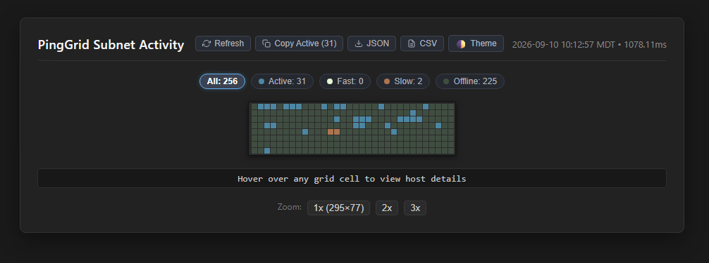

# PingGrid

PingGrid is an extremely fast, cross-platform network ping sweeper and subnet visualizer for IPv4 address ranges. It concurrently pings target addresses and renders an activity grid in multiple formats: **console ASCII/ANSI matrix**, **interactive HTML dashboard**, and **PNG image**.

Runs natively on **Windows**, **Linux**, and **macOS**. Code is almost completely AI-generated, albeit with strict design constraints. Don't hate me, hate the robots.




## Quick Start

```sh
# Sweep active local subnet (zero-config, no arguments needed!)
pg.exe

# Sweep target subnet (positional target syntax)
pg.exe 192.168.1.0/24

# Sweep specific network interface (by name or index)
pg.exe -i "Wi-Fi"
pg.exe -i 1

# List all local network interfaces and exit
pg.exe -I

# Sweep with 3 ping attempts per host for maximum accuracy
pg.exe -p 3

# Continuous live monitoring: refresh sweep every 5 seconds (auto-refreshes terminal & HTML)
pg.exe 192.168.1.0/24 -R 5s

# Output sorted list of host names and ping times (stdout)
pg.exe 192.168.1.0/24 -l

# Save sorted list of host names and ping times to file
pg.exe 192.168.1.0/24 -l hosts.txt

# Standalone interactive HTML dashboard (filters, clipboard copy, zoom, HUD)
pg.exe 192.168.1.0/24 --html dashboard.html

# Minimal embeddable HTML for iframes (zero buttons, transparent, border-fit)
pg.exe 192.168.1.0/24 --iframe embed.html

# Generate PNG activity grid image
pg.exe 192.168.1.0/24 --png matrix.png

# Plain monochrome ASCII mode for simple terminals or automation
pg.exe 192.168.1.0/24 --plain

# Output machine-readable JSON summary
pg.exe 192.168.1.0/24 --json

# Inspect proposed host OS network stack optimizations (dry-run):
pg.exe optimize-os --dry-run

# Apply host OS network stack optimizations (run as Administrator / sudo):
pg.exe optimize-os

# Display help and CLI usage:
pg.exe /?
pg.exe --help
```

## Grid Layout & Color Representation

PingGrid dynamically adapts its grid geometry to match the scanned IP range. For a standard `/24` subnet (256 hosts), it defaults to **8 rows &times; 32 columns** (**295 &times; 77 px**). For custom or smaller ranges (e.g. 50 hosts), rows and columns auto-size dynamically (e.g. **5 rows &times; 10 columns**) while maintaining constant 8&times;8 px square cell proportions across PNG, HTML, and terminal outputs. Resource limits are 1–10 pings, 1–1,024 workers, 1 ms–1 minute timeout, 100 ms–24 hours refresh intervals, and canvases no larger than 16,384 pixels per dimension or 67,108,864 pixels total.

### Color Palette & Meanings

PingGrid uses a curated 9-color palette: `#2c2c2c`, `#efefef`, `#f4eeeb`, `#b1b9a0`, `#4d86a2`, `#ab7550`, `#404e41`, `#fcfcfc`, and `#e4f9d4`.

The default scheme (`--scheme dark`) maps these colors to:

| State / Role | Hex Code | Character | Meaning |
|---|---|---|---|
| **Outer Frame & Dividers** | `#2c2c2c` | `+ - \|` | Canvas bezel, borders, and column dividers. |
| **Offline / Unresponsive** | `#404e41` | `·` | Scanned IP did not reply within timeout. |
| **Active / Online** | `#4d86a2` | `o` | Host responded normally (< `--slow-threshold`). |
| **Slow / Degraded** | `#ab7550` | `*` | High latency node (&ge; `--slow-threshold`, default 100ms). |
| **Gateway / Fast** | `#e4f9d4` | `^` | Gateway or key infrastructure address. |
| **Local Host ("Me")** | Bold Cyan | `@` | The workstation's own IP on the scanned interface. |

### Built-in Schemes

Use `--scheme` / `-s` (or `/scheme`, `-scheme`, `/s`) to switch between preset color combinations:

| Scheme | Matrix Preview | Frame & Dividers | Active / Online | Offline / Quiet | Slow Response | Fast / Gateway |
|---|:---:|---|---|---|---|---|
| **`dark`** *(default)* |  | `#2c2c2c` Charcoal | `#4d86a2` Teal | `#404e41` Moss | `#ab7550` Terracotta | `#e4f9d4` Mint |
| **`light`** |  | `#f4eeeb` Linen | `#4d86a2` Teal | `#fcfcfc` Off-White | `#2c2c2c` Charcoal | `#ab7550` Terracotta |
| **`earth`** |  | `#2c2c2c` Charcoal | `#b1b9a0` Sage | `#886d5b` Earth Brown | `#4d86a2` Slate Teal | `#ab7550` Terracotta |
| **`moss`** |  | `#2c2c2c` Charcoal | `#b1b9a0` Sage | `#465a47` Forest Moss | `#ab7550` Terracotta | `#e4f9d4` Mint |
| **`linen`** |  | `#f4eeeb` Linen | `#897e79` Taupe | `#f4eeeb` Linen | `#ab7550` Terracotta | `#4d86a2` Teal |

All dimensions, grid arrangements, and individual colors can also be overridden via CLI flags. All options and switches accept `-`, `--`, and `/` interchangeably (e.g. `/html`, `-html`, `--html`, `/p 3`, `-p 3`, `/r 5`, `/s moss`). PingGrid protects `255.255.255.255` and directed broadcasts calculated from supplied subnet masks; an address ending in `.255` is still scanned when it is a valid host for that mask. All latency measurements are reported in milliseconds (`ms`). Hex color flags accept values with or without the leading `#` (e.g. `--color-online 4d86a2` or `--color-online "#4d86a2"`). `NO_COLOR` and `--no-color` disable ANSI styling.

## Command-Line Options

```
Usage:
  pg [target] [flags]

Output Options:
  -l, --list [file]              Output sorted list of host names and ping times (optionally write to file)
      --html [file]              Generate standalone interactive HTML dashboard (default: grid.html)
      --iframe [file]            Generate embeddable minimal HTML for iframes (default: grid-embed.html)
      --png [file]               Generate PNG activity grid image (default: grid.png)
      --json [file]              Output versioned machine-readable JSON (optionally write to file)
      --summary [file]           Output single-line text summary (optionally write to file)
      --ascii [file]             Output console ASCII text grid (optionally write to file)

Scan Options:
  -i, --interface <name|index>   Target network interface by name or index (e.g. 'Wi-Fi', 'eth0', 1)
  -I, --interfaces               List detected local network interfaces and exit
  -A, --all-interfaces           Sweep all active local network interfaces simultaneously
  -p, --pings <count>            Ping attempts per host, 1–10 (default 3)
  -R, --refresh <interval>       Refresh interval, 100ms–24h (0 runs once)
      --concurrency <workers>    Concurrent worker budget, 1–1024 (default 256)
      --timeout <duration>       Ping timeout, 1ms–1m (default 150ms LAN, 400ms WAN)
      --slow-threshold <duration> Latency threshold for slow/degraded color (default 100ms)
      --hud                      Display Interface & Link Health HUD banner (default true)
      --no-hud                   Disable Interface & Link Health HUD banner
      --arp                      Pre-warm discovery cache from OS neighbor table and detect silent hosts (default true)
      --no-arp                   Disable OS ARP/neighbor cache integration

Grid Layout Options:
  -r, --rows <count>             Number of grid rows (auto-sized to fit IP range if omitted)
  -c, --cols <count>             Number of grid columns (auto-sized to fit IP range if omitted)
  -W, --width <pixels>           Output image width in pixels (auto-sized if omitted)
  -H, --height <pixels>          Output image height in pixels (auto-sized if omitted)
      --border-width <pixels>    Grid divider border width in pixels (default 1)

Color & Styling Options:
  -s, --scheme <name>            Built-in color scheme (dark, light, earth, moss, linen) (default "dark")
      --color-offline <color>    Hex color for offline/unresponsive hosts (with or without #)
      --color-online <color>     Hex color for active/online hosts (with or without #)
      --color-highlight <color>  Hex color for fast/highlight hosts (with or without #)
      --color-slow <color>       Hex color for slow-responding hosts (with or without #)
      --color-border <color>     Hex color for cell divider lines (with or without #)
      --color-frame <color>      Hex color for outer canvas frame (with or without #)

Standard Options:
      --version, --ver        Display version information and exit
  -v, --verbose               Enable detailed diagnostic output
  -q, --quiet                 Suppress non-essential console output
  -h, --help                  Display help and exit
      --examples              Display detailed usage examples and target formats
      --plain                 Plain monochrome ASCII mode without ANSI colors
      --no-color              Disable ANSI colors (also honored through NO_COLOR)

System Optimization:
      --optimize-os           Tune host OS network parameters for fast sweeping (requires admin/root)
      --dry-run               Inspect proposed OS optimizations without applying changes

Help & Usage:
  Running pg without arguments automatically sweeps your active local subnet.
  Run 'pg --help' or 'pg /?' to display full usage.
  Run 'pg --examples' to see detailed examples and all supported IP range formats.
  Standard Windows and Unix help switches are supported: /?, -?, /h, -h, --help, /help.
```

## Shell Completion

Generate shell autocompletion for `pg` commands, flags, built-in color schemes, and output formats:

### Bash
```bash
# Load completion in the current Bash session:
source <(pg completion bash)

# Persist completion across all Bash sessions:
pg completion bash > /etc/bash_completion.d/pg
# Or locally for the current user:
mkdir -p ~/.local/share/bash-completion/completions
pg completion bash > ~/.local/share/bash-completion/completions/pg
```

### Zsh
```zsh
# Load completion in the current Zsh session:
source <(pg completion zsh)

# Persist completion across all Zsh sessions:
pg completion zsh > "${fpath[1]}/_pg"
```

### PowerShell
```powershell
# Load completion in the current PowerShell session:
pg.exe completion powershell | Out-String | Invoke-Expression

# Persist completion across all PowerShell sessions ($PROFILE):
Add-Content $PROFILE "`npg.exe completion powershell | Out-String | Invoke-Expression"
```

### Fish
```fish
# Load completion in the current Fish session:
pg completion fish | source

# Persist completion across all Fish sessions:
pg completion fish > ~/.config/fish/completions/pg.fish
```

## Examples

### Terminal Subnet Sweep (Default Text Mode)


```sh
# Sweep target subnet and display ASCII activity matrix to console (no files generated)
pg.exe 10.8.0.1/24

# Sweep with 3 ping attempts per host for maximum accuracy
pg.exe 10.8.0.1/24 -p 3
```

### Plain Monochrome ASCII Mode (Automation / Log Files)



```sh
# Plain monochrome ASCII mode for simple terminals or automation:
pg.exe 10.8.0.1/24 --plain
```

### Continuous Live Subnet Monitor
```sh
# Sweep local subnet every 3 seconds with state delta tracking
pg.exe -R 3s
```

### Multi-Adapter Simultaneous Sweeping
```sh
# Simultaneously sweep all active network adapters (Physical LAN, Wi-Fi, Docker, WSL, VPN):
pg.exe -A

# Output sorted host lists for all interfaces:
pg.exe -A -l

# Generate interactive multi-adapter HTML dashboard with tabbed & stacked views:
pg.exe -A --html=multi-grid.html

# Output unified multi-interface JSON metrics:
pg.exe -A --json=multi-scan.json
```

### Sorted Host List (List Mode)
```sh
# Sweep target subnet and print sorted list of host names and ping times to console:
pg.exe 10.8.0.1/24 -l

# Save sorted host list to file (automatically plain text without ANSI colors):
pg.exe 10.8.0.1/24 --list hosts.txt
```

### Standalone Interactive HTML Dashboard



```sh
# Generate standalone interactive HTML dashboard (defaults to grid.html)
pg.exe 10.8.0.1/24 --html

# Specify a custom destination filename directly on the option:
pg.exe 10.8.0.1/24 --html dashboard.html
```

### Embeddable Minimal HTML for Iframes
```sh
# Generate minimal button-free HTML ready for embedding in dashboards or wikis (defaults to grid-embed.html)
pg.exe 10.8.0.1/24 --iframe embed.html
```

### High-Resolution PNG Image
```sh
# Generate PNG activity grid image (defaults to grid.png)
pg.exe 10.8.0.1/24 --png

# Specify custom PNG destination filename:
pg.exe 10.8.0.1/24 --png matrix.png
```

### Structured Output (JSON / Summary)
```sh
# Output machine-readable JSON summary to stdout:
pg.exe 10.8.0.1/24 --json

# Output JSON summary directly to file:
pg.exe 10.8.0.1/24 --json results.json

# Output single-line summary (stdout or file):
pg.exe 10.8.0.1/24 --summary summary.txt
```

### Custom Grid Dimensions and Colors
```sh
# 16x16 grid (256 addresses) rendered as a 512x512 PNG with custom colors
pg.exe 10.0.0.0/24 -r 16 -c 16 -W 512 -H 512 --color-online "#4CAF50" --png lan-matrix.png
```

### Verbose Scan with Diagnostic Output
```sh
pg.exe 10.10.1.0/24 --verbose --timeout 1s -p 2
```
In verbose mode (`-v`, `--verbose`), PingGrid outputs:
- **Discovered Topology Hosts**: Prints the local host IP (`[Me]`), default gateway (`[Gateway]`), local DNS resolvers (`[DNS]`), and DHCP server (`[DHCP]`) prefixed with `+`.
- **Important Host Highlighting (`+`)**: Pre-fixes live responses from important role hosts with `+` and their role badge.
- **Offline Infrastructure Warnings**: Explicitly logs if any key topology host does not respond (`+ Host <IP> <Role> did not respond (offline)`).
- **Tabular List Marking (`-l -v`)**: Prefixes rows for important topology hosts with `+ ` in sorted host lists.

## Output Formats: List, HTML, Embed, PNG, Text, & JSON

PingGrid provides dedicated options to select and configure the desired output:

1. **Sorted Host List (`-l, --list [file]`)**:
   - Produces a columnar, sorted inventory of responding hosts with reverse DNS hostnames, IP addresses, round-trip times (RTT), and latency classifications.
   - Sorted ascending by ping latency (lowest/fastest ping first), with tie-breaking by IP.
   - Automatically performs concurrent, timeout-bounded reverse DNS lookups for responding hosts without slowing down scans.
   - Outputs directly to console with ANSI status highlights, or to a clean plain text file without escape sequences when a filename is specified.

2. **Standalone Dashboard (`--html [file]`)**:
   - Designed for full-screen browser viewing and interactive analysis.
   - Saves to `grid.html` by default, or to any custom filename passed directly to `--html`.
   - **Header Action Buttons**:
     - **Refresh (`⟳ Refresh`)**: Instant manual reload trigger for the dashboard.
     - **Copy Active IPs (`📋 Copy Active (X)`)**: One-click clipboard export of responding host IPs with dynamic count and visual confirmation.
     - **Export JSON (`⬇ JSON`)**: Client-side export and download of complete host scan results as `pinggrid-results.json`.
     - **Export CSV (`⬇ CSV`)**: Client-side export and download of scan metrics (`IP,Status,RTT,Delta`) as `pinggrid-results.csv`.
     - **Theme Toggle (`🌓 Theme`)**: Instant client-side switching between sleek dark mode and light mode.
   - **Click-to-Filter Controls**: Filter the matrix by status (*All*, *Active*, *Fast*, *Slow*, *Offline*, *Deltas*) with dynamic cell dimming.
   - **Interactive HUD & Zoom**: Displays host IP, classification status, millisecond RTT, and 1x/2x/3x zoom scaling.
   - **Live State Delta Log**: Detailed collapsible tracking card highlighting newly joined (`+`), dropped (`-`), or latency-shifted (`~`) hosts across sweeps.
   - **Countdown & Pause**: Live countdown ticker with pause/resume button when running in continuous monitoring mode (`-R`).

3. **Minimal Embed / Iframe Page (`--iframe [file]`, `--embed [file]`)**:
   - Designed strictly for embedding in `<iframe>` containers within dashboards or wikis (e.g. `<iframe src="embed.html"></iframe>`).
   - Saves to `grid-embed.html` by default, or to any custom filename passed directly to `--iframe`.
   - **Zero Buttons**: No zoom buttons, no pause buttons, no filter pills, and no action buttons.
   - **Seamless Fitting**: Transparent background and zero-padding frame wrapping only the pixel-exact activity canvas.
   - **Native Tooltips & Delta Animations**: Hover tooltips and keyframe animations (`joinPulse`, `dropBlink`) preserved.
   - **Silent Auto-Reload**: Automatically refreshes in sync with the sweep loop when `-R` is configured.

4. **PNG Activity Grid Image (`--png [file]`)**:
   - Generates a standalone PNG image representing the network state with pixel-exact square cells and outer frame.
   - Saves to `grid.png` by default, or to any custom filename passed directly to `--png`.

5. **Structured JSON (`--json [file]`)**:
   - Emits schema-versioned summary and host telemetry to stdout or directly to a file.
   - Durations use numeric milliseconds (`duration_ms`, `rtt_ms`); host statuses are lower-case strings.
   - The stable v1 contract is defined by [`docs/json-schema-v1.json`](docs/json-schema-v1.json).
   - Put the target before a space-separated output filename. When the output flag comes first, use `--json=FILE`, `--html=FILE`, and so on; for example, `pg --json=scan.json printer.local`.

6. **Console ASCII Matrix (`--ascii [file]`)**:
   - Visual ASCII grid output rendered directly to the terminal or saved to a text file. Supports rich ANSI color output by default or plain monochrome text via `--plain`.

## Platform Architecture

- **Windows Native ICMP**: Utilizes `iphlpapi.dll`'s `IcmpSendEcho` API from user-mode without requiring Administrator / elevated privileges. High-resolution monotonic timers measure round-trip times down to microsecond accuracy.
- **Linux & macOS ICMP**:
  - **Unprivileged Datagram ICMP**: Employs datagram sockets (`udp4`), supported natively on macOS and Linux distros with `ping_group_range`.
  - **Privileged Raw Socket**: Uses raw ICMP sockets (`ip4:icmp`) when running as root or with `CAP_NET_RAW`.
  - **Subprocess Fallback**: Automatically invokes the system `ping` binary if raw/datagram sockets are restricted.
  - **TCP Discovery Probing**: Probes key ports (53, 80, 445, 22) within the same timeout budget when ICMP mechanisms are unavailable.
- **Cross-Platform Auto-Detection**: Detects primary active IPv4 network interface, true configured subnet mask (e.g. `/22`, `/23`, `/25`, `/28`), and kernel routing table default gateway automatically. Sweeps zero-config out of the box when invoked without arguments.

## OS & Network Interface Optimizations (`pg optimize-os`)

PingGrid includes built-in kernel and physical network interface tuning specifically calibrated for high-throughput, low-jitter network sweeps:

```sh
# Preview proposed optimizations without modifying system settings
pg optimize-os --dry-run

# Apply optimizations (requires Administrator on Windows or root on Linux/macOS)
pg optimize-os
```

- **Energy Efficient Ethernet (EEE / 802.3az)**: Inspects physical NIC hardware and disables transceiver Low Power Idle (LPI) sleep states (`Set-NetAdapterAdvancedProperty` / `ethtool --set-eee`), eliminating wake-up latency jitter and first-packet drop during sweeps.
- **Receive Side Scaling (RSS)**: Verifies global TCP stack multi-core processing (`netsh int tcp show global`) and adapter-level RSS queues across all active NICs to prevent single CPU core bottlenecking during high-concurrency scans.
- **Interrupt Moderation**: Evaluates hardware interrupt coalescing rates and tunes them to adaptive moderation for microsecond latency responses without packet drop.
- **Neighbor Cache & Timers**: Expands IPv4 ARP/neighbor cache capacity to 4,096 entries to prevent table thrashing during large sweeps, extends cache retention to 5 minutes, and lowers dead-host retransmission delay to 200ms.
- **Firewall ICMP Permission**: Creates an application-scoped outbound Windows Firewall rule so PingGrid can send ICMP echo requests; it does not bypass packet inspection.

## Build & Development

### Source Layout

- `main.go` is the versioned executable boundary and delegates execution to `internal/app`.
- `internal/app` owns CLI construction, validation, target preparation, single- and multi-interface orchestration, output selection, interface inventory, and optimizer coordination.
- `internal/report` owns the stable JSON-facing data model, while `internal/scanner`, `internal/grid`, and `internal/sysopt` retain their existing domain responsibilities.

### Prerequisites

1. **Go Toolchain**: Requires Go 1.26.4 or later.
2. **Shared Toolkit**: Keep the `toolkit` checkout in the sibling `../toolkit` directory. `go.mod` consumes its common standards implementation packages directly.
3. **Windows Resources**: Windows builds require `windres`; `build.ps1` and `make build-windows` regenerate the embedded version-resource object before compilation.
4. **Verification Tools**: The full `-Verify` pipeline requires `golangci-lint`, `govulncheck`, and the PowerShell `PSScriptAnalyzer` module.

### Building on Windows (PowerShell)

Use the included native PowerShell build script:

```powershell
# Build pg.exe for Windows:
.\build.ps1

# Cross-compile for Linux (amd64):
.\build.ps1 -Target linux

# Build all platform binaries (Windows, Linux, macOS arm64/amd64):
.\build.ps1 -Target all

# Run full supply-chain, test, lint, and vulnerability pipeline:
.\build.ps1 -Verify
```

### Building with Make (Linux / macOS / GNU Make)

```sh
# Build default binary (pg.exe on Windows, pg on POSIX)
make build

# Cross-compile for Linux (amd64)
make build-linux

# Cross-compile for macOS (Apple Silicon + Intel)
make build-darwin

# Cross-compile all targets
make build-all

# Fast local check (format, vet, unit tests - no network needed)
make check

# Verify module checksums against go.sum (SC-0002)
make verify-deps

# Scan dependencies for known CVE vulnerabilities via Go vulnerability DB (SC-0004)
make vuln

# Full CI / supply-chain audit pipeline (verify-deps + fmt + vet + lint + test + race + vuln)
make ci
```

### Direct Go CLI Build

```sh
# Standard build:
go build -o pg.exe .

# Linux static binary (pure Go, zero CGO):
CGO_ENABLED=0 GOOS=linux GOARCH=amd64 go build -o pg-linux-amd64 .
```

### Build & Compilation Notes

- **Version & Build Metadata**: The application version is compiled from `main.go`; build scripts inject the Git commit hash and deterministic commit timestamp using `-ldflags`:
  ```sh
  go build -ldflags "-X github.com/m8urnett/PingGrid/internal/version.GitCommit=$(git rev-parse --short HEAD) -X github.com/m8urnett/PingGrid/internal/version.BuildDate=$(git show -s --format=%cI HEAD)" -o pg.exe .
  ```
  The authoritative application version is the `const version` declaration in [`main.go`](main.go). It uses the required `1.xx.NNN` representation: significant changes increment `xx` and reset `NNN`, and subsequent application builds increment `NNN`.
- **Pure Go Static Binaries (`CGO_ENABLED=0`)**: Linux and macOS cross-compilation builds set `CGO_ENABLED=0` to create completely static, portable executables with zero external C library or glibc dependencies.
- **Linux Network Capabilities**: Windows uses `iphlpapi.dll` without requiring elevation. On Linux, if unprivileged ICMP datagram sockets (`udp4`) are disabled by default on your distribution, grant socket capabilities or enable the sysctl ping group range:
  ```sh
  # Option A: Grant raw socket capability to binary
  sudo setcap cap_net_raw+ep ./bin/pg-linux-amd64

  # Option B: Enable unprivileged ICMP sockets system-wide
  sudo sysctl -w net.ipv4.ping_group_range="0 2147483647"
  ```
- **Self-Contained / Offline Builds (`vendor`)**: In air-gapped or offline CI environments, you can vendor all third-party dependencies using:
  ```sh
  go mod vendor
  go build -mod=vendor -o pg.exe .
  ```
- **Automated Tests**: Run the unit suite and race detector, covering color schemes, HTML templates, state deltas, CIDR generation, interface parsing, and CLI validation:
  ```sh
  go test -v ./...
  go test -race ./...
  ```

## Host OS Network Stack Optimization

PingGrid includes a built-in cross-platform optimizer (`pg optimize-os` or `pg --optimize-os`) to tune host kernel network parameters for high-throughput, low-latency ICMP sweeping:

> [!IMPORTANT]
> **Privilege Requirement**: Modifying kernel network stack and firewall parameters requires **Administrator** rights on Windows and **Root (`sudo`)** rights on Linux/macOS. When run without elevation, PingGrid inspects the system, displays the current vs. proposed values, and shows the exact command needed to run with elevated privileges.
>
> Use `--dry-run` to preview changes at any time without modifying system settings:
> ```sh
> pg.exe optimize-os --dry-run
> ```
>
> Optimizations are applied independently and are not automatically rolled back if a later step fails. Record current values from the dry-run output before applying them.

### Platform Tunings Applied

* **Windows** (via `netsh` and PowerShell):
  * **Global Neighbor Cache Limit**: Expands from 256 to 4096 entries per interface (`netsh interface ipv4 set global neighborcachelimit=4096`) to prevent cache thrashing during large subnet sweeps.
  * **Neighbor Reachable Duration**: Extends base reachable duration to 300,000 ms (5 minutes) so active hosts remain cached across repeated sweep cycles.
  * **Retransmission Interval**: Lowers neighbor retransmission backoff from 1000 ms to 200 ms.
  * **Windows Firewall Permission**: Registers an application-scoped outbound ICMP rule for `pg.exe`; this permits traffic but does not bypass packet inspection.
* **Linux** (via `sysctl`):
  * `net.ipv4.neigh.default.mcast_solicit = 1`: Drops dead-host multicast ARP probes from 3 attempts to 1.
  * `net.ipv4.neigh.default.retrans_time_ms = 100`: Lowers ARP retransmission wait time from 1000 ms to 100 ms.
  * `net.ipv4.neigh.default.base_reachable_time_ms = 300000`: Caches resolved active hosts for 5 minutes.
  * `net.ipv4.neigh.default.gc_thresh3 = 4096`: Expands maximum neighbor table size to 4096 entries.
  * `net.ipv4.ping_group_range = "0 2147483647"`: Enables unprivileged ICMP ping sockets for all users.
* **macOS** (via `sysctl`):
  * `net.link.ether.inet.max_age = 1200`: Extends retention lifespan of resolved ARP cache entries to 1200 seconds.
  * `net.link.ether.inet.prune_intvl = 60`: Sets ARP prune clean interval to 60 seconds.
  * `kern.ipc.maxsockbuf = 4194304`: Expands maximum socket buffer capacity for concurrent sweeps.

## License

This software is dedicated to the public domain under [The Unlicense](LICENSE). You are free to copy, modify, publish, use, compile, sell, or distribute this software for any purpose.
